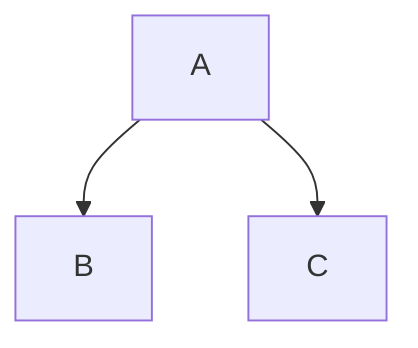

Learning Git and Github!
========================
Subheadline
-----------

This is a footnote[^1].

Version control is an **essential skill** for _developers_ to master, and ~~Git~~ is by far the most popular version control system on the web. In this fast-paced course, author Ray Villalobos `shows` you how to install Git and use the fundamental commands you need to work with Git projects: moving files, managing logs, and working with branches.
***
> Plus, you'll [learn](https://linkedinlearning.com) how to work with the popular GitHub website to explore existing projects, clone them to your local hard drive, and use them as templates for your new projects.

 Another footnote[^2].

```js
let x = 5;
console.log(x);
```
😄

> [!NOTE]
> A note

> [!IMPORTANT]
> Important

> [!WARNING]
> Warning




***
- Item One
- Item Two

1. Item One
1. Item Two
   * indented
   * another one

| Left  | Center | Right   |
| ----  | :----: | ----:   |
| One   | Two    | $1.00   |
| Three | Four   | $120.00 |
| Five  | Six    | $.99    |

- [x] First
    - [x] One
    - [ ] Two
- [ ] Second

<details>
  <summary>collapsed</summary>
  
  # Header
  
  This the copy for the collapsed text.
</details>


[^1]: My reference.
[^2]: Another reference.
